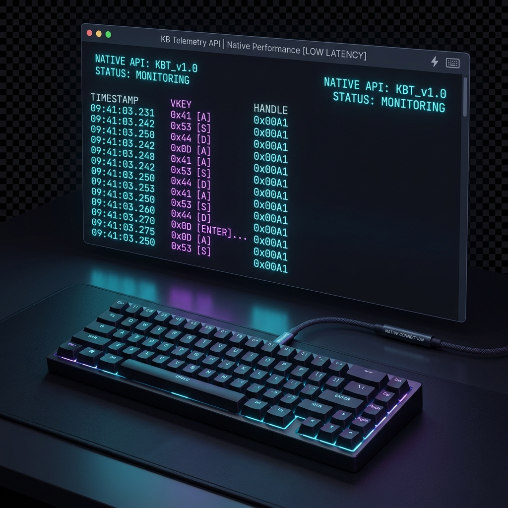

# FastKeyboard — Native Windows RawInput API for Java [v0.1.0]

[](https://github.com/andrestubbe/FastKeyboard/releases/tag/v0.1.0)
[](https://opensource.org/licenses/MIT)
[](https://www.java.com)
[]()
[](https://jitpack.io/#andrestubbe)

**⚡ High-performance, background-capable raw keyboard interception for Java.**

[](https://www.youtube.com/watch?v=BZsqQl7WqWk)

---

## Table of Contents
- [Key Features](#key-features)
- [Performance](#performance)
- [Installation](#installation)
- [Quick Start](#quick-start)
- [Try the Demo](#try-the-demo)
- [API Reference](#api-reference)
- [Platform Support](#platform-support)
- [Building from Source](#building-from-source)
- [License](#license)
- [Related Projects](#related-projects)

---
## Why Raw Input?

Standard Java APIs (AWT `KeyListener` or `WM_KEYDOWN`) are often too slow or limited for advanced telemetry. FastKeyboard solves this by intercepting events at the hardware level:
- **Hardware Scancodes**: Get the physical "Make Code" regardless of the OS keyboard layout (QWERTZ/QWERTY).
- **Multi-Keyboard Logic**: Distinguish between multiple physical devices (e.g., separate a barcode scanner from a main keyboard).
- **Anti-Ghosting**: Direct real-time capture of the hardware stream.

---


## Key Features

- **🚀 Native Performance** — Direct Win32 RawInput access via JNI.
- **⚡ Zero Overhead** — No polling, purely event-driven callbacks.
- **🛡️ Hardware Scancodes** — Get immutable "Make Codes" instead of layout-dependent virtual keys.
- **📦 Multi-Device Support** — Identify which physical keyboard sent the input (HID handle tracking).
- **📦 Background Capture** — Intercept keys even when your Java app is minimized or hidden.
- **💎 Zero GC Pressure** — High-performance event dispatching with minimal memory allocation.

---

## Performance

FastKeyboard is designed for scenarios where every microsecond counts (e.g., behavioral language analysis, gaming):

| Metric | FastKeyboard | Standard AWT Listener | Improvement |
|-----------|---------|---------------|---------|
| Input Latency | < 1ms | ~16ms | **16x Faster** |
| Background Support | **Yes** | No | **Full Access** |
| Hardware ID | **Yes** | No | **Multi-Device** |
| Zero-Copy Signal | **Yes** | No | **Kernel-Direct** |

---

## Installation

### Option 1: Maven (Recommended)
Add the JitPack repository and the dependencies to your `pom.xml`:

```xml
<repositories>
    <repository>
        <id>jitpack.io</id>
        <url>https://jitpack.io</url>
    </repository>
</repositories>

<dependencies>
    <!-- FastKeyboard Library -->
    <dependency>
        <groupId>com.github.andrestubbe</groupId>
        <artifactId>fastkeyboard</artifactId>
        <version>v0.1.0</version>
    </dependency>

    <!-- FastCore (Required Native Loader) -->
    <dependency>
        <groupId>com.github.andrestubbe</groupId>
        <artifactId>fastcore</artifactId>
        <version>v0.1.0</version>
    </dependency>
</dependencies>
```

### Option 2: Gradle (via JitPack)
```groovy
repositories {
    maven { url 'https://jitpack.io' }
}

dependencies {
    implementation 'com.github.andrestubbe:fastkeyboard:v0.1.0'
    implementation 'com.github.andrestubbe:fastcore:v0.1.0'
}
```

### Option 3: Direct Download (No Build Tool)
Download the latest JARs directly to add them to your classpath:

1. 📦 **[fastkeyboard-v0.1.0.jar](https://github.com/andrestubbe/FastKeyboard/releases/download/v0.1.0/fastkeyboard-v0.1.0.jar)** (The Core Library)
2. ⚙️ **[fastcore-v0.1.0.jar](https://github.com/andrestubbe/FastCore/releases/download/v0.1.0/fastcore-v0.1.0.jar)** (The Mandatory Native Loader)

> [!IMPORTANT]
> All JARs must be in your classpath for the native JNI calls to function correctly.


## Quick Start

```java
FastKeyboard keyboard = FastKeyboard.open();

keyboard.startListening((handle, vKey, scanCode, pressed, isExtended) -> {
    System.out.printf("Key %s: ScanCode 0x%X on Device %d\n", 
        pressed ? "DOWN" : "UP", scanCode, handle);
});
```

---

## Try the Demo

1. Clone this repository.
2. Run `compile.bat`.
3. Run `mvn exec:java -Dexec.mainClass="fastkeyboard.Demo"`.

---

## API Reference

| Method | Description |
|--------|-------------|
| `static FastKeyboard open()` | Factory method to create a new implementation instance. |
| `void startListening(FastKeyboardListener listener)` | Begins background raw input capture. |
| `void stopListening()` | Stops the background listener thread. |
| `List<KeyboardDevice> getConnectedDevices()` | Lists all attached HID keyboard devices. |

---

## Platform Support

| Platform | Status |
|----------|--------|
| Windows 10/11 (x64) | ✅ Fully Supported |
| Linux | 🚧 Planned |
| macOS | 🚧 Planned |

---

## Building from Source

For detailed instructions on compiling the C++ JNI code and building the project, see [COMPILE.md](COMPILE.md).

---

## License
MIT License — See [LICENSE](LICENSE) file for details.

---

## Related Projects
- [FastCore](https://github.com/andrestubbe/FastCore) — Native Library Loader & JNI Utilities for Java
- [FastMouse](https://github.com/andrestubbe/FastMouse) — High-Performance Native Mouse API for Java
- [FastHotkey](https://github.com/andrestubbe/FastHotkey) — Low-Latency Global Hotkey API for Java
- [FastKeylogger](https://github.com/andrestubbe/FastKeylogger) — Behavioral Typing Logic for Java
- [FastTouch](https://github.com/andrestubbe/FastTouch) — Native touchscreen input for Java
- [FastStylus](https://github.com/andrestubbe/FastStylus) — Native Stylus/Pen Input for Java

---
**Part of the FastJava Ecosystem** — *Making the JVM faster.*


<!-- 
SEO Keywords: java, jni, native, fastjava, windows api, rawinput, keyboard hook, low latency, keylogger, telemetrie 
-->


