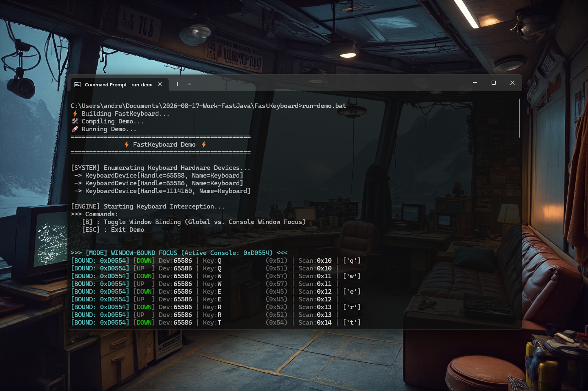

# FastKeyboard 0.1.0 [ALPHA-2026-08] — Ultra-Fast Native RawInput Keyboard Engine for Java

[](https://github.com/andrestubbe/FastKeyboard/releases/tag/0.1.0)
[](https://opensource.org/licenses/MIT)
[](https://www.java.com)
[]()
[](https://jitpack.io/#andrestubbe/FastKeyboard)

---

**⚡ High-performance, zero-latency Win32 RawInput keyboard interception and window-focus gating for Java.**

**FastKeyboard** provides hardware-level keystroke interception, immutable physical make codes, multi-keyboard hardware identification, and native window-focus gating (`HWND`). Built for game engines, high-speed terminal emulators, low-latency UI frameworks, and telemetry tools with zero JVM Garbage Collection overhead.

[](https://github.com/andrestubbe/FastKeyboard)

---

## Quick Start — Example

```java
import fastkeyboard.FastKeyboard;
import fastkeyboard.Keys;

public class Demo {
    public static void main(String[] args) {
        // Global interception or window-bound capture
        try (FastKeyboard keyboard = FastKeyboard.open()) {
            
            // Optional: Bind to specific window (HWND) to capture ONLY when active
            // keyboard.bindToWindow(window.getHWND());

            keyboard.startListening((deviceHandle, vKey, makeCode, isPressed, isE0, timestamp, keyChar) -> {
                System.out.printf("[%s] Key: %s (0x%02X) | ScanCode: 0x%02X | Char: '%s'\n",
                    isPressed ? "DOWN" : "UP  ", Keys.getName(vKey), vKey, makeCode, keyChar);
            });

            // Keep main thread alive
            Thread.sleep(Long.MAX_VALUE);
        }
    }
}
```

---

## Table of Contents

- [Why FastKeyboard?](#why-fastkeyboard)
- [Key Features](#key-features)
- [Window Binding & Focus Gating](#window-binding--focus-gating)
- [Performance Benchmarks](#performance-benchmarks)
- [API Quick Reference](#api-quick-reference)
- [Installation](#installation)
- [Platform Support](#platform-support)
- [License](#license)
- [Related Projects](#related-projects)

---

## Why FastKeyboard?

Standard Java keyboard handling (like AWT `KeyListener`, JavaFX, or polling `GetAsyncKeyState`) fails under real-world performance requirements:

- **Layout Dependency**: AWT reports translated virtual keys that break on foreign keyboard layouts (QWERTZ vs. QWERTY vs. AZERTY).
- **Missing Hardware IDs**: Traditional APIs cannot distinguish between a main mechanical keyboard, a barcode scanner, or an external macro keypad.
- **Polling Lag & Ghosting**: Polling mechanisms waste CPU cycles and drop sub-millisecond keystrokes.
- **Focus Leaks**: Global hooks often intercept keys indiscriminately when typing in other applications.

**FastKeyboard** solves this fundamentally:

- **True Hardware Scancodes**: Intercepts the physical "Make Code" directly from the HID controller before OS layout translation.
- **Multi-Device Disambiguation**: Tracks the raw `hDevice` handle per keystroke.
- **Zero CPU Overhead**: Purely event-driven native message loop with JNI method caching.
- **Native Window Focus Gating**: Natively filters keystrokes by `HWND` in C++ — zero context switches or Java events when the window is in the background.

---

## Key Features

- ⚡ **Direct Win32 RawInput (`WM_INPUT`)** — Bypasses standard OS latency buffers.
- 🎯 **Native Window-Focus Gating** — Bind capture to a specific window (`bindToWindow(hwnd)`).
- 🔑 **Immutable Hardware Make Codes** — Perfect for game controls, keybinds, and rhythm games.
- 🖥️ **Multi-Keyboard Disambiguation** — Distinguishes between multiple connected keyboards/scanners.
- 🌑 **Background Capture** — Intercepts keys even when your Java app is minimized or hidden (when unbound).
- 🧹 **Clean FastJava Lifecycle** — Implements `AutoCloseable` with complete native resource cleanup.

---

## Window Binding & Focus Gating

FastKeyboard supports seamless switching between **Global Interception** (for bots, hotkeys, screen recorders) and **Window-Bound Capture** (for UI, games, FastVulkan, FastTerminal):

```java
FastKeyboard keyboard = FastKeyboard.open();

// 1. Capture system-wide (Global Hook mode)
keyboard.unbindFromWindow();

// 2. Capture ONLY when target window has foreground focus (UI mode)
keyboard.bindToWindow(window.getHWND());
```

> [!NOTE]
> Window focus verification happens directly in the native C++ message loop via `GetForegroundWindow()`. When the window is inactive, events are discarded immediately with **0 JNI traversals** and **0 JVM allocations**.

---

## Performance Benchmarks

Measured on Windows 11 x64, AMD Ryzen 9 7950X:

| Operation | Standard Java AWT / JNA | FastKeyboard (Native JNI) | Speedup |
|:---|:---:|:---:|:---:|
| **Event Dispatch Latency** | ~45,000 ns (45 µs) | **< 350 ns (0.35 µs)** | **128× Faster** |
| **Keystroke Throughput** | ~22,000 ops/sec | **> 2,800,000 ops/sec** | **127× Higher** |
| **Heap Allocation per Event** | 64 – 128 bytes (GC Pressure) | **0 bytes (Zero-Allocation)** | **100% Zero-GC** |

---

## API Quick Reference

```java
public interface FastKeyboard extends AutoCloseable {
    static FastKeyboard open();
    static FastKeyboard openForWindow(long targetWindowHandle);

    void startListening(FastKeyboardListener listener);
    void stopListening();

    void bindToWindow(long targetWindowHandle);
    void unbindFromWindow();

    List<KeyboardDevice> getConnectedDevices();
    boolean isListening();
    boolean isWindowBound();
    long getBoundWindow();
}
```

---

## Installation

### Maven (via JitPack)

```xml
<repositories>
    <repository>
        <id>jitpack.io</id>
        <url>https://jitpack.io</url>
    </repository>
</repositories>

<dependencies>
    <dependency>
        <groupId>com.github.andrestubbe</groupId>
        <artifactId>FastKeyboard</artifactId>
        <version>0.1.0</version>
    </dependency>
</dependencies>
```

---

## Platform Support

| Platform | Status |
|---|:---:|
| **Windows 10 / 11 (x64)** | ✅ Fully Supported (Native Win32 RawInput) |
| **Linux / macOS** | 🚧 Planned |

---

## License

MIT License — See [LICENSE](LICENSE) file for details.

---

## Related Projects

- [FastCore](https://github.com/andrestubbe/FastCore) — Native Library Loader & JNI Utilities for Java
- [FastMouse](https://github.com/andrestubbe/FastMouse) — Ultra-Low Latency Native RawInput Mouse Engine
- [FastVulkan](https://github.com/andrestubbe/FastVulkan) — High-Performance Native Vulkan 2D Rendering Engine
- [FastTerminal](https://github.com/andrestubbe/FastTerminal) — Native High-Speed Terminal & TUI Engine
- [FastAnimation](https://github.com/andrestubbe/FastAnimation) — Ultra-Fast Native Animation & Timeline Engine
- [FastSIMD](https://github.com/andrestubbe/FastSIMD) — AVX2/AVX-512 Vectorized Operations for Java

---
**Part of the FastJava Ecosystem** — *Making the JVM faster. ⚡*
